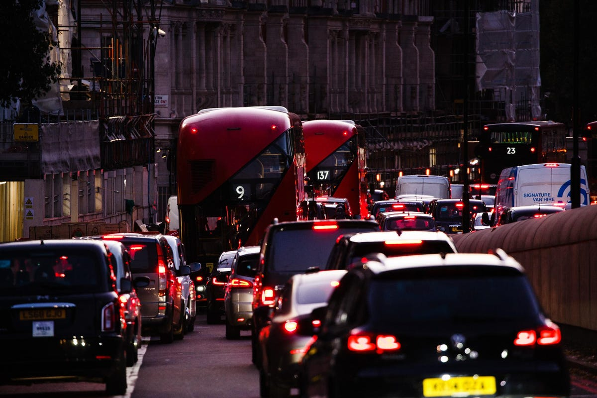
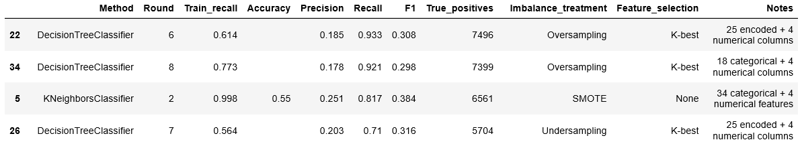
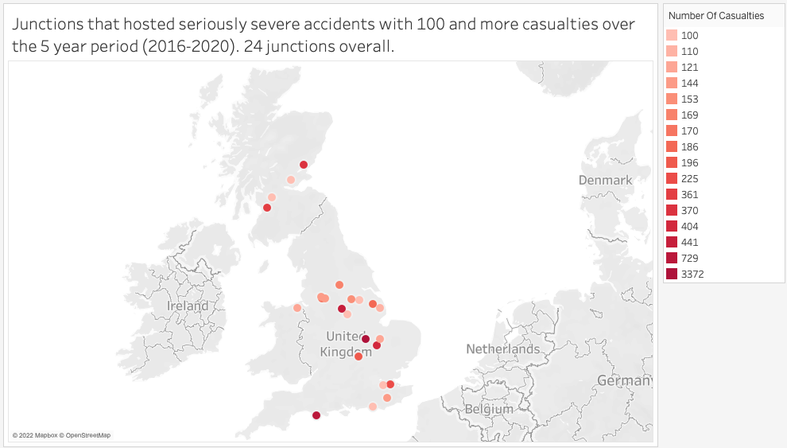
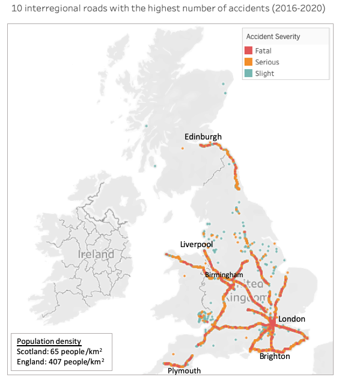

# Patterns in Road Accidents: The case of United Kingdom

by Elif Cihan Yildirim

## Summary
World Health Organization declares road traffic injuries as the leading cause of death for children and young adults (2022). Furthermore, millions of people are affected by traffic accidents every year. This project is designed to support the discussions about the road safety in the UK by providing a comprehensive view on the spatial, temporal, and demographic patterns in road accidents. Among the results of this project, I present the junctions and interregional roads that had been the accident hotspots in Great Britain between the years 2016 and 2020. Furthermore, I provide a machine learning model predicting the severity of hypothetical accidents based on factors such as the age and sex of driver, vehicle type, latitude and longitude, light conditions etc.

## Data
For this project, I downloaded the [road safety datasets](https://www.data.gov.uk/dataset/cb7ae6f0-4be6-4935-9277-47e5ce24a11f/road-safety-data) for 2016-2020 which was published by the UK Department for Transport. The three datasets that are used in the project provide information on i) all registered accidents, with details on ii) the vehicles and iii) the casualties involved. The data is in encoded form rather than being textual strings and the lookup table is available from the same website.

The shapes of the datasets are

i)	accident dataset: 597973 rows × 37 columns, 

ii)	vehicle dataset: 1101591 rows × 27 columns, 

iii)	casualty dataset: 781716 rows × 18 columns.

Exploratory analysis was conducted on all data sets and the predictive models were built only on the dataset that is created by combining the accident and vehicle datasets using accident index and vehicle reference.

## Exploratory Data Analysis (EDA)
Some portion of this project was dedicated to understand whether accident severity may be considered as a function of certain conditions. In the dataset, accident severity is described in three classes: Slight, serious, and fatal. Exploratory data analysis reveals that the presence of some of the conditions may be playing a role in the severity of an accident. In fact, the investigation of the i) first point of impact, ii) light conditions, iii) weather conditions, and iv) casualty type parameters show that: 

•	The likelihood of an accident being deathly is higher if the accidental hit is received from the front of the vehicle.

•	Most accidents take place in daylight and good weather. 

•	The proportion of fatal accidents that take place in dark over daylight is higher in comparison with the respective proportions in the slightly severe and seriously severe cases. 

•	The relative proportions of different weather conditions hardly vary between the each class of accident severity. This may point out that accident severity may be independent of the weather conditions.

•	Overall, 50% of all the casualties in road accidents are car occupants. However, the largest two classes of casualties are the pedestrians and cyclists in large cities, for example in London. In fact, car occupants make up only the 5% of the casualty population in London.

## Predicting Accident Severity using Machine Learning Algorithms
I created a classification model that predicts the severity of accidents based on factors such as driver's age, vehicle type, time, light conditions etc. I built a model selection pipeline (including Logistic Regression, KNN, Decision Tree and Random Forest classification algorithms), performed feature selection using the K-best algorithm, optimized model hyperparameters using random search and fine-tuned with cross-validation. 35 different models were created before picking the best performing model, which is a DecisionTreeClassifier with a recall score of 93%.

Before building the models, the original classes in the accident severity (slight, serious, and fatal) were reduced to two classes by grouping the serious and fatal together (as ‘serious’). As a matter of fact, both the serious and fatal accidents would need similar level of attention. This decision was also based on the fact that the three classes in the target had very different sizes. Especially, the size of the ‘fatal’ accidents is substantially smaller than the slightly severe accidents. It is known that classification algorithms in the case of imbalanced target class sizes favor the major class if the imbalance in the training dataset is not treated. Combining these classes reduced this imbalance but not entirely. The training dataset was treated for imbalance using i) SMOTE, ii) undersampling, and iii) oversampling separately.

Recall and the true positives is the preferred evaluation metric in this project. In accordance with this, DecisionTreeClassifier model built in round 6 is the best predictive model in forecasting the severity of a hypothetical accident. Thanks to feature selection, this model has the least number of columns as input of all the 35 different models built in this project. Metrics of the 4 top performing models:

The best performing model predicts severity of the hypothetical accidents based on: 

1. attributes of the road (speed limit, light conditions, road type, second road class, urban/rural area, easting/northing),

2. attributes of the junctions travelled through (location, control type, details),

3. attributes of the driver (age, sex, driver's home area),

4. attributes of the vehicle (age, type, engine capacity),

5. travel-related features such as time (specifically whether the travel is between 8-9 am or not) and the vehicle's travel direction (from/to),

6. first point of impact & vehicle's manoeuvre at the time of the accident.

This list is not in the order of feature importance. All models were trained and tested with the data from the year 2017. The final model was validated twice, using the data from 2016 and 2020 separately.

##  Discussion on Model Evaluation Metrics
Test accuracy of the initial models (before treating the data for imbalance) were above 80%, which may not seem too bad at first sight. The confusion matrix, however, tells a different story. Those models fail in predicting the seriously-severe accidents, which is too expensive for the case of the road accidents. Evidently, accuracy is not a suitable evaluation metric for this model and recall will be preferred as the model evaluation metrics.

It is notable that all of the imbalance treatment techniques (SMOTE, oversampling, and undersampling) increased the recall at the cost of lower precision, which is actually preffered in the case of road accidents. In other words, I would prefer this model to predict a potentially 'slightly-severe' accident as 'seriously-severe', rather than a 'seriously-severe' potential accident as 'slightly-severe'. False positives are preferred over false negatives here. The final classification model is able to predict 36,152 seriously severe accidents out of 38,698 seriously severe accidents that happened in year 2016 (the validation dataset).

Finally, drivers' attention to the road and how responsible both the drivers and the pedestrians behave in traffic may be among many of the non-quantifiable features that are affecting the occurrence and severity of an accident. These are not incorporated into this model.

## Accident hotspots in the UK

Based on the data covering a 5-year period between the years 2016 and 2020, there are 24 junctions in the UK which are hotspots for seriously severe accidents. It is notable that almost all of them are 'Give way or uncontrolled' type of junctions. A preventative action proposal may be installing traffic lights to these junctions. In addition to that, presence of traffic police at these junctions from time to time may help control the number of accidents in these junctions.

This study also identfied the top 10 interregional roads (A-Roads) with the highest number of accidents. The majority of them are in England, one is partially in Scotland and one is in the Wales. Higher population density of England in comparison with the Scotland and the Wales may be playing a role in occurence of more accidents in England.

## Tools
Jupyter notebook 6.4.8.

Numpy, pandas, sklearn

Seaborn, matplotlib

MySql

Tableau

## References

[World Health Organization](https://www.who.int/news-room/fact-sheets/detail/road-traffic-injuries#:~:text=Road%20traffic%20injuries%20are%20the,pedestrians%2C%20cyclists%2C%20and%20motorcyclists)

[Tablaeu file: UK_Road_Safety](https://public.tableau.com/views/UK_Road_Safety/Numberofaccidentsperyearseverity?:language=en-US&:display_count=n&:origin=viz_share_link)

[Tablaeu file: UK_accident_hotspot_junctions](https://public.tableau.com/views/UK_accident_hotspot_junctions/Junctionsthathostedseriouslysevereaccidentswith100andmorecasualtiesoverthe5yearperiod2016-2020_24junctionsoverall_?:language=en-US&:display_count=n&:origin=viz_share_link)

[UK Road Safety Data](https://www.data.gov.uk/dataset/cb7ae6f0-4be6-4935-9277-47e5ce24a11f/road-safety-data)

[Daily Life In London](https://www.gettyimages.com/detail/news-photo/cars-and-buses-queue-in-a-long-traffic-jam-on-knightsbridge-news-photo/1229230414?adppopup=true)

